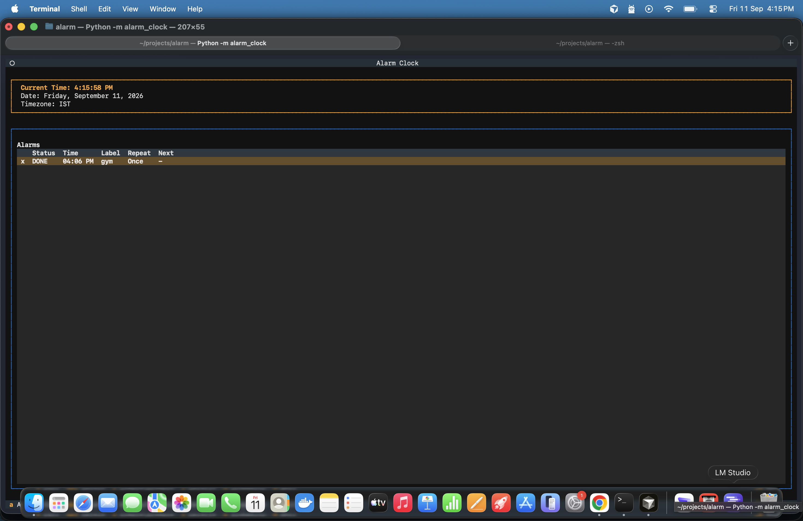

# Alarm Clock



Terminal-based alarm clock with a Textual TUI. See `docs/REQUIREMENTS.md` and `docs/DESIGN.md`.

## Setup

```bash
python3 -m venv .venv
source .venv/bin/activate
pip install -e ".[dev]"
```

## Run

```bash
python -m alarm_clock
# or with an explicit database:
python -m alarm_clock --db /tmp/alarms-test.db
```

Default database path: `~/.alarm-clock/alarms.db`

## Tests

```bash
pytest
```
